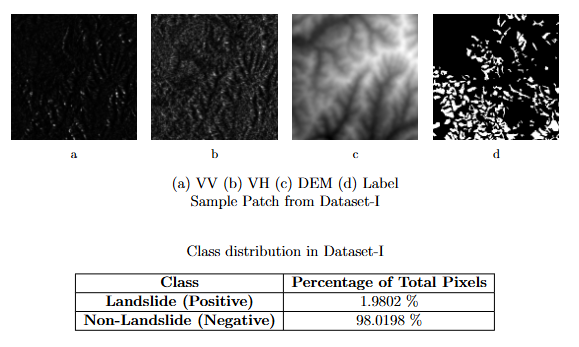
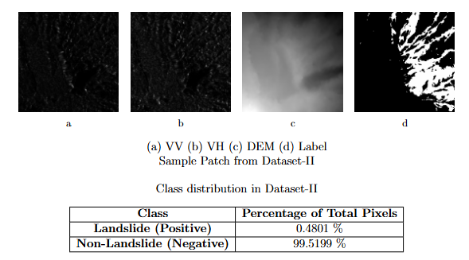
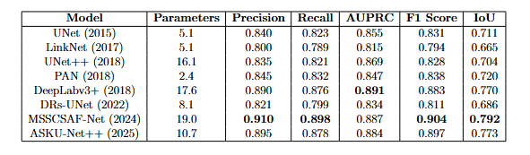
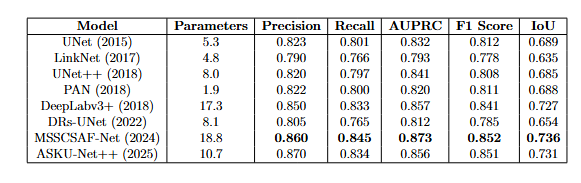
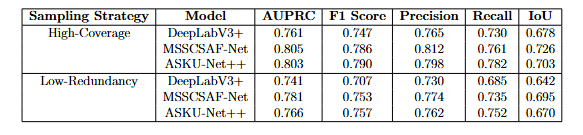

# 🌍 Landslide Detection Using SAR Data & Deep Learning

## 📌 Overview
Landslides are highly destructive natural hazards that cause severe damage to infrastructure and loss of life. This project presents a **deep learning-based semantic segmentation pipeline for automated landslide detection using multi-temporal Synthetic Aperture Radar (SAR) data**. 

Unlike optical imagery, SAR data enables **robust monitoring under all weather and lighting conditions**, making it highly suitable for disaster response systems.

---

## 🎯 Objectives
* Develop an **end-to-end landslide detection pipeline**.
* Compare multiple **state-of-the-art segmentation architectures**.
* Analyze the effect of **data sampling strategies**.
* Evaluate **cross-region generalization capability**.
* Improve detection using **multi-modal SAR + terrain features**.

---

## 🚀 Key Contributions
* Designed a **multi-temporal SAR-based segmentation framework**.
* Implemented **ASKU-Net++**, an advanced attention-based model adapting UNet++ with asymmetric convolutions to handle SAR-specific noise.
* Evaluated **8 deep learning models** for landslide detection.
* Proposed and analyzed **two sampling strategies**:
    * **High-Coverage Sampling**: Improves detection performance through class-balanced representation.
    * **Low-Redundancy Sampling**: Reduces dataset size while maintaining competitive performance.
* Integrated **multi-modal inputs (VV, VH, DEM)** to capture structural deformation and terrain context.
* Demonstrated **cross-region generalization (Japan → Indonesia)**.

---

## 🛰️ Datasets

### Dataset I: Hokkaido, Japan (2017)
* **Trigger**: Sequence of seismic events followed by intense rainfall.
* **Contents**: 26 temporal Sentinel-1 SAR acquisitions.
* **Polarization**: Dual-polarized SAR intensity (VV & VH).
* **Ancillary Data**: Aligned Digital Elevation Model (DEM) data.
* **Labels**: Pixel-wise landslide segmentation masks.

### Dataset II: Mt. Talakmau, Indonesia
* **Trigger**: Strong earthquake in early 2022 followed by heavy rain.
* **Contents**: 20 temporal SAR acquisitions.
* **Environment**: Densely forested and agricultural volcanic slopes.
* **Usage**: Assessment of model generalization to varied terrain and vegetation.

---

## 🧠 Data Processing Pipeline
1. **Preprocessing**: Cropping original datacubes into dimensions that are multiples of 256 pixels.
2. **Channel Selection**: Combine VV polarization, VH polarization, and DEM.
3. **Patch Extraction**: Generate **256 × 256 patches**.
4. **Sampling Strategy**: Apply High-Coverage or Low-Redundancy selection.
5. **Data Split**: 80% training and 20% testing split.

---

## 🧩 Sample Data

### Dataset 1 (Hokkaido, Japan)

  

---

### Dataset 2 (Indonesia)

  

---

## 🤖 Models Implemented
*   **U-Net (2015)**: A symmetric encoder-decoder framework with skip connections that bridge spatial resolution from the encoder to the decoder; ideal for handling small, sparse targets like landslides.
*   **LinkNet (2017)**: A lightweight architecture using ResNet-like blocks and residual skip connections to improve gradient flow and semantic retention while minimizing parameters.
*   **U-Net++ (2018)**: Enhances the standard U-Net with nested, dense convolutional blocks in skip pathways to reduce the semantic gap between feature maps.
*   **PAN (Pyramid Attention Network, 2018)**: Integrates spatial attention with pyramid pooling to capture a large receptive field, helping to emphasize informative structures against background SAR noise.
*   **DeepLabv3+ (2018)**: Utilizes Atrous Spatial Pyramid Pooling (ASPP) to capture multi-scale context, which is critical for identifying landslides of varying spatial extents.
*   **DRs-UNet (2022)**: Embeds Dense Residual (DR) blocks to combine feature reuse from DenseNet with the gradient stability of ResNet for deeper representation learning.
*   **MSSCSAF-Net (2024)**: Employs multi-scale skip-connected channel-spatial attention fusion to learn associations between spectral (SAR) and spatial (DEM) cues.
*   **ASKU-Net++ (2025)**: An advanced attention-based model featuring asymmetric convolutions to increase orientation sensitivity for detecting elongated landslides on steep slopes.

---

## 🏗️ Model Architecture (ASKU-Net++)
* **Structure**: Adaption of UNet++ utilizing asymmetric convolutions and skip connections.
* **Noise Mitigation**: Tailored to suppress SAR-specific noise patterns and geometric distortions.
* **Feature Refinement**: Uses attention gates to capture directional and elongated features common on landslide slopes.

---

## ⚙️ Training Details
* **Patch Size**: 256 × 256
* **Epochs**: 100
* **Batch Size**: 4
* **Optimizer**: **AdamW** (Learning rate: $1 \times 10^{-2}$, Weight decay: $1 \times 10^{-4}$)
* **Loss Function**: **Dice Loss** (optimized for imbalanced segmentation)
* **Hardware**: NVIDIA Tesla P100 (Kaggle)

---

## 📊 Evaluation Metrics
* **Precision**: Proportion of correct positive predictions.
* **Recall**: Ability to identify all actual landslide pixels.
* **F1 Score**: Harmonic mean of precision and recall.
* **IoU (Intersection over Union)**: Measure of overlap between predicted and ground truth masks.
* **AUPRC**: Area Under the Precision-Recall Curve, suitable for class-imbalance problems.

---

## 📈 Key Results

### 📊 Quantitative Comparison

  

| Model | F1 Score (High-Coverage) | IoU (High-Coverage) | F1 Score (Low-Redundancy) |
| :--- | :---: | :---: | :---: |
| **MSSCSAF-Net** | **0.904** | **0.792** | **0.852** |
| **ASKU-Net++** | 0.897 | 0.773 | 0.851 |
| **DeepLabv3+** | 0.883 | 0.770 | 0.841 |

* **Generalization**: Top models trained on Japan achieved strong F1 scores (up to 0.790) when tested on the Indonesia dataset.
* **Robustness**: MSSCSAF-Net emerged as the most stable and high-performance configuration across all geographic regions.

---

### 🖼️ Qualitative Results & Visualizations

#### High-Coverage Sampling Results (Dataset 1)

  

#### Low-Redundancy Sampling Results (Dataset 1)

  

#### Cross-Dataset Generalization (Dataset 2 - Indonesia)

  

  <em>Segmentation results on Dataset-II. Top row: High-Coverage sampling. Bottom row: Low-Redundancy sampling.</em>

---

### 💡 Key Observations & Comparative Analysis

From the results, several key observations emerge:
* **Approach 1’s high-coverage sampling scheme** usually attained higher segmentation performance, which could be ascribed to class-balanced representation and higher spatial diversity in the training set.
* Despite less redundancy, **Approach 2 (low-redundancy sampling scheme)** still provided competitive performance, and notably, for MSSCSAF-Net, which preserved the best performance through much less duplicated data.
* **MSSCSAF-Net** always surpassed all the other models in F1 score for both sampling strategies, proving effective in making use of multi-scale and multi-modal information for accurate landslide segmentation.
* **DeepLabv3+** likewise ran well, obtaining the best AUPRC under the high-coverage condition, and was still a contender under the low-redundancy scenario.
* **PAN** demonstrated excellent performance considering its light architecture, once again proving that an effective model can be competitive when accompanied by proper sampling and regularization methods.

---

## 📉 Training Performance

  

* Stable convergence across epochs.
* Improved performance due to deep supervision.

---

## 🛠️ Tech Stack
* **Core**: PyTorch, PyTorch Lightning.
* **Computer Vision**: segmentation-models-pytorch, Albumentations.
* **Geospatial Data**: xarray, rasterio, zarr.
* **Metrics**: TorchMetrics.

---

## 📄 Report
📘 For in-depth methodology and analysis, refer to the full report:
`MajorProject.pdf`.

---

## 🔮 Future Work
* Implementing **Transformer-based architectures** (Vision Transformers).
* Evaluating models on larger global datasets for broader applicability.
* Developing real-time monitoring and web-based deployment systems.

---

## 👨‍💻 Author
**Manav Rajpal**
M.Tech – Signal Processing & Machine Learning
National Institute of Technology Karnataka (NITK), Surathkal

---

## ⭐ Support
If you found this project useful, consider giving it a ⭐
